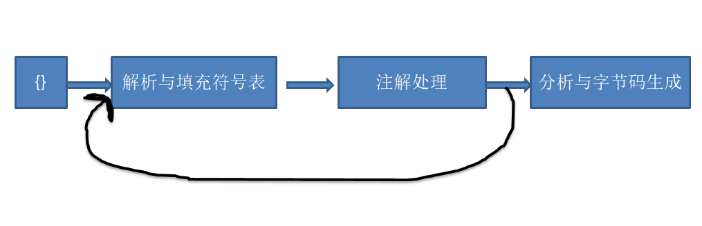
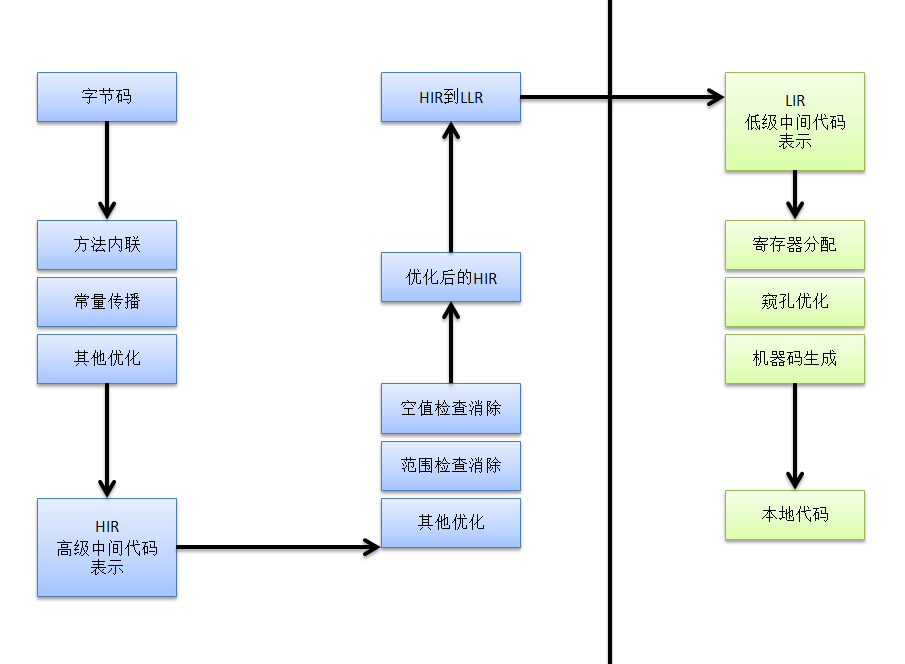

#### GitHub-理解JVM系列：
[https://github.com/kevinten10/Effective-Java](https://github.com/kevinten10/Effective-Java)

------------------------------------------------------------------------------------------------------------------------------------------------
# 一、早期（编译器）优化
##### 1. 前期编译器：javac
*.java => *.class
##### 2. 后端运行期编译器：JIT
字节码 => 机器码
##### 3. 静态提前编译器：AOT
*.java => 机器码

## 1. javac编译器

#### 1.1 解析与填充符号表
* 词法语法分析：
	* 源代码的字符流 ==> 标记token集合
	* 如 int a = b + 2;  ⇒ int , a , = , b , + , 2 
* 根据token序列构造**抽象语法树**
* 此后，编译器基本上不会再操作源代码，而是操作抽象语法树
* 填充符号表：
	* 由一组符号地址和符号信息构成

#### 1.2 注解处理器：
插入到抽象语法树

#### 1.3 语法分析与字节码生成
* 对结构上正确的源程序进行审查
	* **类型检查**
	* 逻辑审查
* 解析语法糖：
	* 虚拟机不支持语法糖的语法，需要解析为基础语法，故添加某种语法糖，其实对功能无影响
* 字节码生成：
	* com.sun.tools.javac.jvm.ClassWriter类

## 2. 语法糖
#### 泛型与类型擦除
编译时，将泛型擦除，.class字节码中无泛型信息
#### 自动拆装箱
编译后还原为对应的基本类型，使用.parseXXX()和.valueOf()进行
#### 遍历循环foreach
转换为迭代器： list.iterator()，需要实现iterator接口
**for(Iterator; iterator.hasNext();iterator.next())** 
#### **条件编译**
当条件为常量时（true/false），在编译期就会删除掉不成立的分支

## 3. 自定义注解处理器
javac命令的-processor参数添加注解处理器

-----------------------------------------------------------------------------------------------------------------------------
# 二、晚期（运行期）优化
#### 即时编译器（Just In Time Compiler）JIT编译器：字节码==>机器码
当某个方法/代码块运行频繁==>热点代码==>进行优化

##### 解释器
不编译，立即执行 ==> 启动迅速 ⇒ 可节约内存
##### 编译器
编译成本地代码 ==> 效率高 ==> 提升效率

##### 逆优化
优化失败后，退回解释状态

### Hotspot即时编译器
Client Compiler : C1 字节码 ==> 本地代码，简单优化 ==> 更快
Server Compiler:C2 字节码 ==> 本地代码，复杂优化 ==> 更好

##### 混合模式
解释模式 -Xint
编译模式 -Xcomp

#### 编译对象与触发条件
##### 热点代码
* 被多次调用的代码 ==> 方法调用出发，编译整个方法
* 被多次执行的循环体 ==> 编译发生在方法执行中，“栈上替换”
#### 热点探测
* 基于采样：周期性检查栈顶，若经常出现在栈顶，则热
* 基于计数器：
	* 方法调用计数器
	* 回边计数器
* 方法调用计数器
	* 阈值
		* client 1500
		* server 10000
  * 统计一段时间，技术减半 ==> 衰减（半衰周期）
* 回边计数器：统计方法中循环体的执行次数
	* 阈值
		* client 13995
		* 10700
	* 统计绝对次数

##### 若以编译 ==> 修改方法入口 ==> 调用本地代码版本
##### 若未编译 ==> 计数到达 ==> 请求编译（后台编译线程队列）

---------------------------
### 编译过程

#### 1. 优化技术
* 方法内联
	* 去除方法调用成本
	* 将方法内容插入到方法调用处
* 公共子表达式消除
	* 不重复计算
* 数组边界检查消除
	* 不必每次都进行隐含的条件判断：越界
* 逃逸分析
	* 栈上分配：堆=>栈
	* 同步消除：消除同步措施
	* 当确定一个对象不会逃逸到方法外时，可使用

#### **当可能异常时，使用if进行判断，每次进行条件判断但是开销小**
#### **当异常不太可能抛出时，使用try...catch...进行处理，因为创建异常快照开销大，但不必每次都进行if判断**