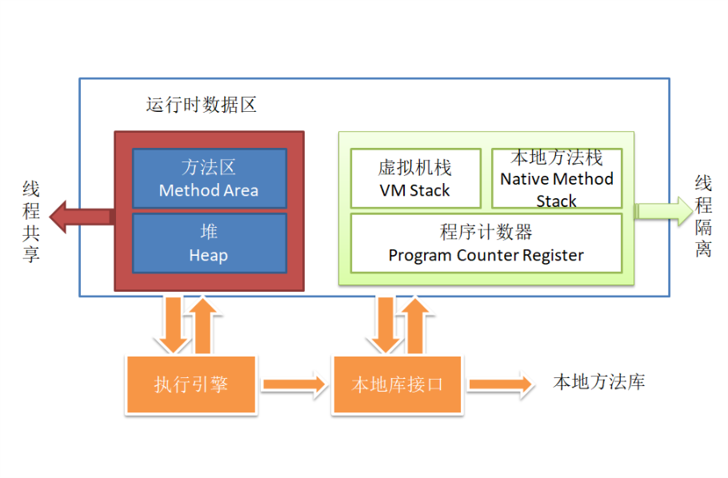
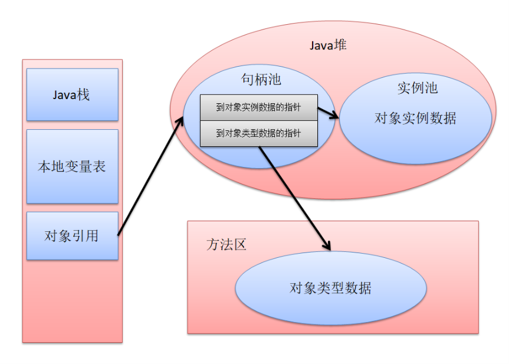
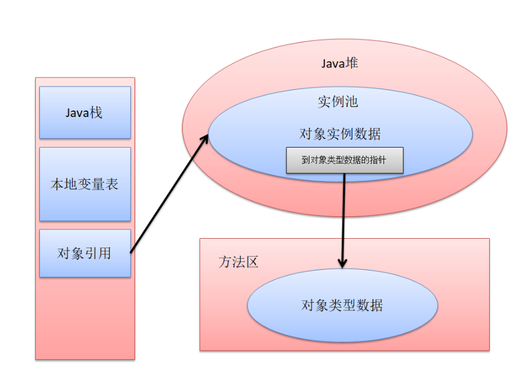
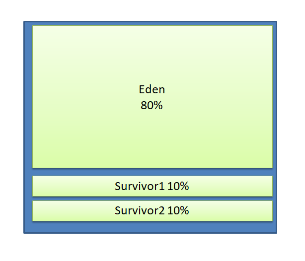

------------------------------------------------------------------------------------------------------------------------------------------------
# JVM内存区域分析

## 1. 程序计数器PC
* 当前线程所执行的字节码的行号指示器
* 字节码解释器通过改变PC的值来选取下一条程序
* 线程独立，互不影响，在线程私有的内存区域中
* 如果执行Java代码，指向虚拟机字节码指令地址
 如果执行native方法，PC为空（undefined）

## 2. 虚拟机栈
* 线程私有，生命周期与线程相同
* **Java方法内存模型**：
    * 每个方法在执行的同时都会创建一个栈帧，存储局部变量表，操作数栈，动态链接，方法出口等（所谓的栈内存）
    * 每个方法从调用到完成，就对应一个栈帧从入栈到出栈
    * 局部变量表（编译器可知）
		* 基本数据类型
		* 对象引用（指针，指向对象起始地址）
		* return address，指向一条字节码指令地址
	* 所需的内存空间在编译期间分配完成
* Stack OverflowError（定长时）线程请求的栈深度大于最大值
* OutOfMemoryError（动态扩展）无法申请到足够内存

## 3. 本地方法栈
* 根据不同语言（一般是C/C++）自由实现
* 会抛出与虚拟机栈相似的异常

## 4. 堆
* 虚拟机所管理内存中最大的一块
* 线程共享，在虚拟机启动时创建
* 只存放对象实例
* GC堆（garbage collected heap）垃圾收集器管理的主要区域
* 堆中划分出多个线程私有的分配缓冲区（thread local allocation buffer）
	* 进一步划分是为了更好的回收内存，更快的分配内存
* GC堆中有新生代和老年代，永久代（已弃用）等不同空间
* 物理上可处于不连续内存空间
* 逻辑上要求连续内存空间
* 无法拓展时，抛出OutOfMemoryError

## 5. 方法区
* 线程共享
* 存储已被虚拟机加载的类信息，常量，静态变量，即时编译器编译后的代码（热点代码）
* 方法区描述为堆的一个逻辑部分，但是非堆
* 物理上可不连续
* 垃圾回收主要针对常量池回收和类型的卸载（效果较差，可选择不实现垃圾收集）
* **运行时常量池**
	* class文件 -> 常量池：存放编译期生成的各种字面量和符号引用
	* 类加载进入方法区后存放到运行时常量池
	* 动态性：运行期间可能将新常量放入池中

## 6. 直接内存
* 不属于Java虚拟机中的内存区域
* 例如NIO，使用native函数库直接分配堆外内存
	* 通过存储在Java堆中的对象，作为堆外内存的引用来进行操作
	* 避免了在Java堆中和native堆中来回复制数据
* 受总内存影响，根据实际内存设置-Xmx参数信息

--------------------------------------------------------------------------------------------------------------------------------------------

# 虚拟机对象探秘

##  1. 对象的创建
* **new指令**
	* 检查指令的参数是否能在常量池中定位到一个类的符号引用
	* 检查该类的符号引用是否已被加载，解析，和初始化。若未，先类加载
	* 为新对象分配内存：所需内存大小在类加载后便确定
* **内存分配方法：**
	* Java堆绝对规整（空内存连续） --> 指针碰撞法
	* Java堆不规整 --> 维护空内存列表 --> 空闲列表法
	* .......等内存分配算法
* **线程安全**
	* 若同时修改堆内存指针 --> 不安全
	* 对分配内存空间的动作进行同步处理（锁+失败重试） 
	* 每个线程在Java堆中预先分配一小块内存：本地线程分配缓冲区（TLAB），使用完重新分配时，才同步锁定
		* 可通过 -XX：+/-UseTLAB 设置TLAB
	* 将分配的内存空间初始化为零值（不包括对象头）
	* 设置对象头：类的元数据，对象哈希码，对象GC分代年龄
	* new完成
	* 执行init()方法，进行对象初始化

## 2. 对象内存布局
|对象头|
|实例数据|
|对齐填充|

* **对象头**
	* 对象自身的运行时数据
		* 哈希码
		* GC分代
		* 锁
		* ...
	* 类型指针：指向类元数据
	* 若为数组，还有一块记录长度
* **实例数据**
	* 相同宽度的字段分配在一起
	* 从父类继承的和子类一起分配
* **对齐填充**
	* 对象起始地址为8字节整数倍，即对象大小为8字节整数倍
	* 对象头为8字节倍数，填充实例数据

## 3. 对象访问定位
* **句柄法**
	* 对象移动时，只改变句柄

* **直接指针法**
	* 节省一次指针定位，速度快

## 实战：OutOfMemoryError错误分析
* **Java堆溢出**
	* 对象过多，且回收不及时
	* 内存泄漏：应回收的对象保留了引用，无法回收
	* 内存溢出：存活的对象过多
		* 可查看机器物理内存，尝试调大虚拟机堆内存
* **虚拟机栈和本地方法栈溢出：**
	* 操作系统分配给进程空间（32位）--> 最大2GB
	* 2GB - 最大堆容量 - 最大方法区容量 - PC指针区（较小） = 栈容量	 
* **方法区和运行时常量池溢出**
	* 如大量JSP --> 动态生成大量servlet.class文件 --> 方法区溢出
* **直接内存溢出**
	* 默认与Java堆最大值一样

------------------------------------------------------------------------------------------------------------------------------------------------------------
# 垃圾收集器GC
## 1. 对象死亡
#### **1.1 引用计数法**
问题： 无法解决互相循环引用
#### **1.2 可达性分析算法**

GC Roots对象：从GC Roots出发，遍历以下引用链上的对象

* 虚拟机栈中引用的对象
* 方法区中静态属性引用的对象
* 方法去中常量引用的对象
* 本地方法栈中native方法引用的对象

#### **1.3 引用类型**
* 强引用：new，不会回收
* 软引用：有用但非必须，内存不足时回收
* 弱引用：非必须，下一次垃圾收集回收
* 虚引用：仅提供一个通知
####  **1.4 对象死亡过程**
**两次标记**，第二次时才会执行Object中的finalize()方法，默认不做任何操作

* 引用连不可达，标记，判断是否需要finalize()
* 执行finalize()，虚拟机启动低优先级的finalize线程，对象在F-Queue中，等待进行回收
#### **1.5 回收方法区**
1. 废弃常量
 
2. 无用类
 
* 所有实例都被回收
* 该类加载器已被回收
* class对象没有被引用

## 2. 垃圾收集算法
#### **2.1 标记-清除**
> 适用于“老年代”	、

1. 标记
2. 清除

问题：效率低，空间碎片大 

#### **2.2 复制**
> 适用于“新生代”

分成大小相等的两块，当一块内存用完，将活着的对象复制到另外一块内存中

问题：空间利用率低

#### **复制的应用**：

新生代对象死亡率98%，故使用复制处理新生代
每次使用Eden与一块survivor （90%大小）
回收时复制到另一块survivor （10%大小）
当survivor空间不够时，复制到担保区（老年代）

#### **2.3 标记-整理**
> 适用于"老年代"

1. 所有存活对象向一端移动
2. 直接清理掉边界外内存

## 3. HotSpot虚拟机的算法实现
1. 枚举根节点
	* GC停顿：引用分析时执行系统被冻结->引用不能处在变化中
	* 准确式GC：使用OopMap存放引用位置，不用再一一查找
2. 安全点
	* 程序跑到安全点上，然后可挂起，执行GC
3. 安全区域
	* 线程sleep/blocked时无法运行到安全点，进入安全区域

### 垃圾收集器
#### serial收集器
#### parnew收集器
#### parallel scarenge收集器
#### CMS收集器
* 获取最短回收停顿时间
#### G1收集器
* 对象优先在Eden分配
* 大对象直接进入老年代
* 长期存活的对象将进入老年代
* 动态对象年龄判定
	* 当servivor空间中相同年龄的所有对象，大小总和大于sur空间的一半时。大于等于该年龄的对象就可以进入老年代
* 空间分配担保
	* 老年代 > 新生代  => 担保一定成功
	* 老年代 < 新生代  => 担保有风险 

