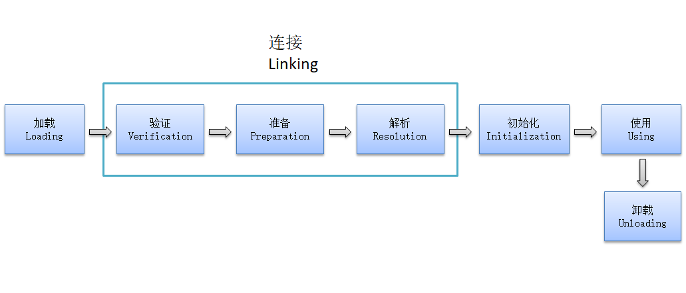
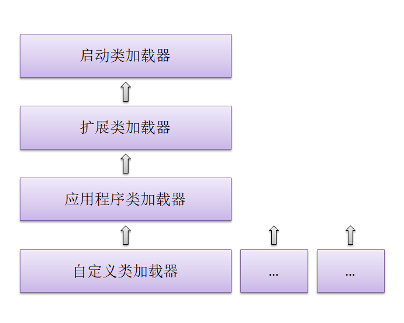
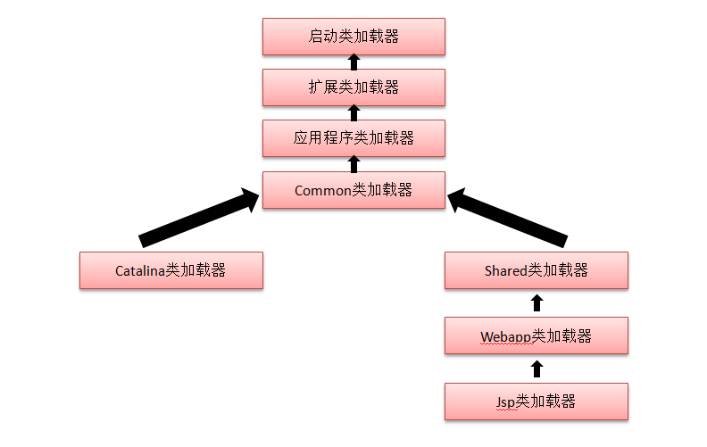

------------------------------------------------------------------------------------------------------------------------------------------------
# 一、类文件结构
#### Java虚拟机不和包括Java在内的所有编程语言绑定，它只和"class文件"这种特定的**二进制文件格式**所关联

#### class文件中包含了**Java虚拟机指令集和符号集**以及若干其他辅助信息

* Java：*.java => javac  =>      ↘
* jruby：*.rb    => jrubyc =>       →    字节码 *.class => Java虚拟机    
* groovy：...   => groovyc =>    ↗

---------------------
## 1. class类文件结构
* 8位字节为基础单位的二进制流
* 各个数据项目，严格按照顺序紧密排列，无任何分隔符
* 若需占用8个字节以上，按高位在前的方式分割成若干8字节（最高位在地址最低处）
* 只有两种数据类型
	* 无符号数：u1,u2,u3,u4代表1，2，3，4个字节
	* 表：由多个无符号数或其他表构成的复合类型

--------------------------
## 2. 字节码指令
* 1字节长度+参数：2^8 = 256种
* 虚拟机面向操作数栈，而不是寄存器，故大多数不包括操作数
* 放弃操作数长度对齐
	* 优点：无需补齐，高效
	* 缺点：需要从字节中重建出具体数据的结构
* 操作码只有一个字节

```
do{
  1. PC+1
  2. 根据PC位置，从字节码流中取出操作码
  3. if(操作数存在){取出操作数}
  4. 执行操作码
}while(字节码流>0)
```

----------------------
## 3. class文件格式
```
classfile{
	u4              magic               魔数
	u2              minor_version       次版本号
	u2              major_version       主版本号
①☆ u2              constant_pool_count
②☆ cp_info         constant_pool    
    u2              access_flags        访问标志：类/接口层次的访问信息
    u2              this_class          类索引
    u2              super_class         父类索引
    u2              interfaces_count    实现接口数
③  u2              interfaces  
    u2              fields_count        成员变量
④☆ field_info      fields 
    u2              methods_count       方法
⑤☆ method-info     methods 
    u2              arttributes_count 
⑥☆ attribute_info  attributes 
}

* info结尾为表结构    
```
①常量池计数值
②常量表

* 类和接口的全限定名
* 字段的名称和描述符-->未初始化（运行时初始化），无具体信息
* 方法的名称和描述符-->未初始化，无真正内容信息

③实现的接口
④字段表集合/成员变量 --> 类变量/实例变量
⑤方法表集合：方法描述， 重载方法-->不同特征签名
⑥属性表集合：class文件，字段表，方法表都可以携带自己的属性表集合

#### **Java虚拟机指令设计 **
* 将输入的虚拟机代码在加载或执行时，翻译成另一虚拟机的指令集
* JIT，翻译成CPU本地指令集

------------------------------------------------------
# 二、虚拟机类加载机制 

## 1. 类加载


### 懒惰加载机制：
#### 有且仅有五种情况 => 立即初始化
* new，读取/设置静态域，调用静态方法
* 反射加载（.class加载时不初始化）
* 初始化一个类，对其父类先初始化
* 执行的主类在VM启动时
* 动态方法句柄？
#### 除此之外，所有引用类的方式都不会触发初始化-->“被动引用”
* .class
* 调用父类静态域，子类不会初始化
* 接口初始化时，不要求父类接口初始化，调用时才初始化


### 类加载过程解析：
#### **1. 加载**
* 通过类的全限定名，获取类的二进制字节流（.class文件）
* 将字节流代表的静态存储结构--->方法区的运行时数据区
* 在内存中生成此class对象，作为方法区的访问入口

#### **2. 连接（与加载交叉进行）**
#### **2.1 验证**
* 是否符合虚拟机要求
* 保护虚拟机安全
* 是否有编译错误
##### 文件格式验证：是否符合class文件格式，魔数、版本号、常量池类型....
##### 元数据验证：是否符合Java语言规范，验证方法区中的语法语义
##### 字节码验证：逻辑验证（最复杂）
##### 符号引用验证：解析时发生

#### =>若确保不需要验证，可使用-Xverify：none关闭验证

#### **2.2 准备**
* 为类变量分配内存并设置初始值（非初始化）
* 设置为零值（内存全部置0），引用类型逻辑上为null
* static final域根据定义设置初始值，如“123”

#### **2.3 解析**
* 将常量池中的符号引用替换为直接引用的过程
	* 符号引用：字面量，class格式中，与内存无关
	* 直接引用：直接指向目标的指针（内存中）
* 类接口解析
* 字段解析
* 类方法解析
* 接口方法解析

#### **3. 初始化**
* 初始化static域
* 父类先于子类
* 多线程同时初始化一个类，线程安全，只有一个执行其余阻塞

-------------------------------------------------------------------------------------------
## 2. 类加载器
* Java虚拟机外部
* 通过类的全限定名获取类的二进制字节流
* 每一个类加载器，都有一个独立的类名称空间
* 比较类是否“相等”，只有同一个类加载器时才有意义（类似于命名空间的作用）

### 1. 双亲委派模型
* 启动类加载器
	* 扩展类加载器
		* 应用程序类加载器
			* 自定义类加载器


#### 启动类加载器
* 是虚拟机的一部分，由C++实现
* 加载 JAVA_HOME/lib 目录中的类
#### 扩展类加载器
* 加载 JAVA_HOME/lib/exb 目录中的类
* 由Java实现
#### 应用程序类加载器
* 加载用户类路径 CLASSPATH 上指定的类库
* 系统类加载器，程序中默认的类加载器
* Java实现

#### **类加载过程**
* 如果一个类加载器收到类加载请求，首先不自己去加载
* 将请求委派给父类处理，所有请求都传送到顶层的启动类加载器
* 只有父类加载器反馈自己无法完成这个加载请求（搜索范围没有找到所需的类）
* 才会由子类加载器尝试去加载

##### 优点：在不同程序中，启动类加载的同一个类，不随程序变化


## 3. 虚拟机字节码执行引擎
* 虚拟机最核心的组成部分之一

#### **运行时栈帧结构：stack frame  （在虚拟机栈区域，线程私有）**


#### 1. 局部变量表
* 变量值存储空间，存放方法参数，方法内部变量
* 容量以变量槽slot为最小单位
	* 32位
	* 64位：32+32
* 通过索引定位使用局部变量表：从0至最大slot数
	* **若是实例方法，则索引0为对象实例的引用（this）**
* slot可重用，节省空间
##### 2. 操作数栈
* 最大深度在编译时写入
* 字节码指令指向栈中 存入/提取 内容，如算术运算
* 元素类型要与字节码指令序列严格匹配
#### 3. 动态连接
* 方法区常量池中的方法引用，在运行期间转为直接引用
	* 句柄法
	* 直接指针法
#### 4. 方法返回地址
* 异常时返回地址（正常退出可以使用PC作为返回
* 保存在异常快照中，故抛出异常会有较大的开销

--------------------------------
#### **方法调用** ：确定被调用方法的版本
#### ①解析
所有方法调用中的目标方法在class文件里面都是常量池中的符号引用
静态解析：在类加载的解析阶段，将符号引用替换为直接引用

#### ②分派
##### 静态分派-----重载
（引用类型）Human man = new Man()（内存类型）;
Human为静态类型（编译器可知），重载时，根据静态类型进行分派
##### 动态分派-----重写
Man为实际类型（运行期确定）

* 建立了实际类型的内存空间
* 在操作数栈顶的第一个元素的实际类型
* 根据实际类型进行方法调用

##### 动态类型语言：类型检查在运行期（变量本身没有类型，变量的值才有类型）
##### 静态类型语言：类型检查在编译器（生成符号引用，保存到class中）

#### **字节码解释执行引擎**
源码-->词法分析-->抽象语法树-->指令流-->解释器-->解释执行

--------------------------------------------------------------------------------------
## 4. Tomcat类加载器架构
#### 目录
##### ①/common：被Tomcat与所有web程序可见
##### ②/server：被Tomcat可见，web不可见
##### ③/shared：web可见，Tomcat不可见
##### ④/webapp/WEB-INF：此web可见，其他web不可见

#### ①②③默认合并为/lib目录

#### 类加载模型（双亲委派模型）


在Tomcat中，common类加载器将会加载/lib目录下的jar包，被所有web应用公用，而每个web应用的类加载器都是相互隔离的，故而每个web应用都有独立的命名空间。