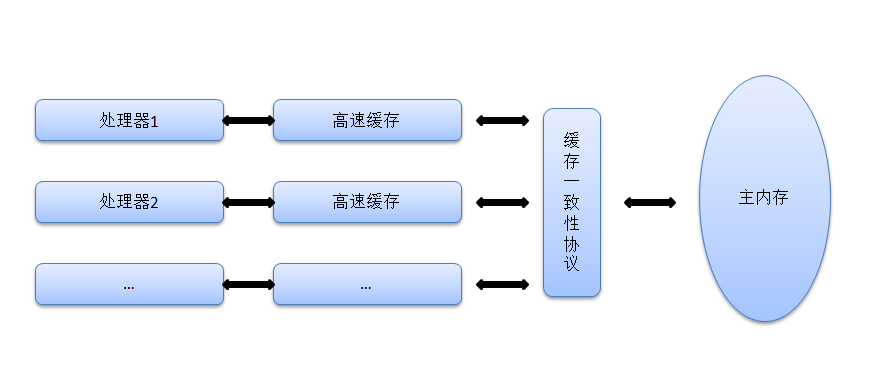
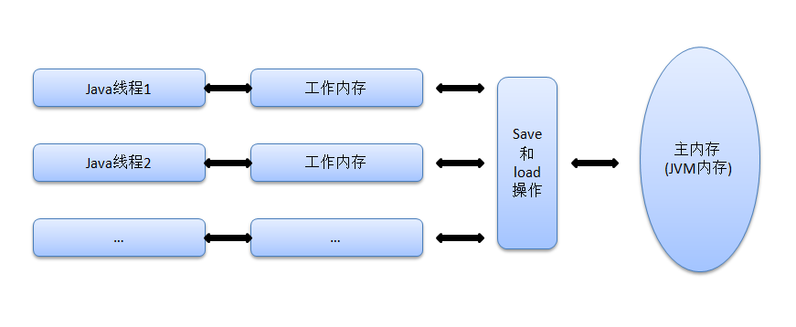
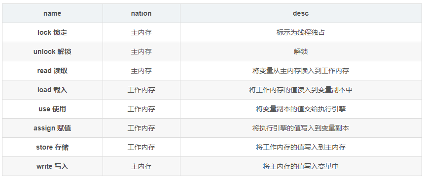
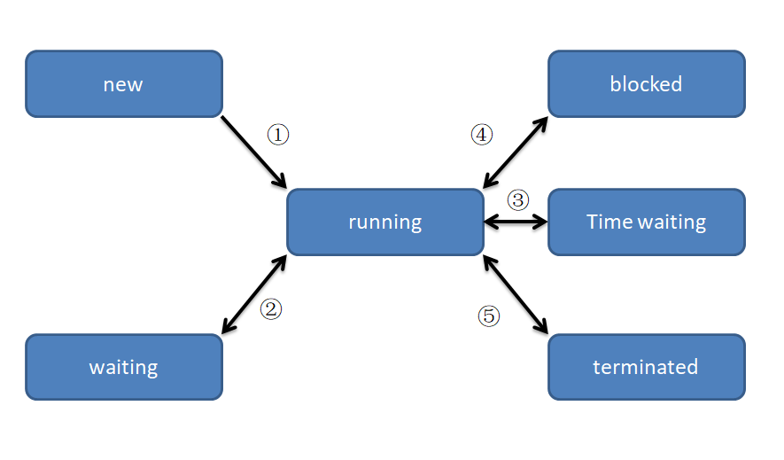

------------------------------------------------------------------------------------------------------------------------------------------------
# 一、Java内存模型与线程
## 处理器内存模型

## Java内存模型
 

### Java内存模型
1. 所有变量都存储在主内存中
2. 工作内存中保存了使用变量的主内存副本拷贝（**拷贝引用，字段，并非对象的全部**）
3. 线程对变量的所有操作都在工作内存，不能直接对主内存操作
4. 不同线程之间只能通过主内存传递变量

---------------------------------------------------------------------------------------------------------
## 内存交互
### 8原子操作
#### 1. 同步 2. 读 3. 操作 4. 写

### 8原子操作的8基本规则
1. read+load 或 store+write 成对出现，顺序执行，但可能非连续
2. 若执行了assign（赋值），必须写回主内存
3. 不允许无assign时，将变量副本写回主内存
4. 新变量只能在主内存初始化，工作内存不能使用未初始化值
5. lock可以多次，需要相同次数的unlock才能解锁
6. lock时，会清空工作内存中的副本值，执行引擎若要使用，需要重新load或者assign
7. 不能unlock未lock的值
8. unlock之前，必须先同步回主内存（store+write）

--------------------------------------------------------
### volatile变量 “易变的”
1. 读和普通变量无差别，写稍慢
2. 禁止重排序优化，新值可以立即被其他线程读取
	* **重排序**：CPU将多条指令不按顺序的分开发送给各相应电路处理
3. 通过变量修改后将新值立即同步回主内存，在变量读取前从主内存刷新变量
4. **非线程安全**

#### [为什么volatile也无法保证线程安全?](https://zhuanlan.zhihu.com/p/44518376)

------------------------------------------------------------
#### Java线程模型与操作系统
使用内核线程实现 ==> 开销高
使用用户线程实现 ==> ×，（线程阻塞后整个进程被阻塞）

**使用线程加轻量级进程混合实现**，
**Java通过线程1:1映射的方式，将Java线程映射为LMP轻量级进程，再映射为内核线程KST**

#### Java线程调度
* 协同式线程调度：线程控制，线程完成后主动释放 ==> 阻塞危机
* 抢占式线程调度：系统控制，（可通过thread.yield()主动释放）

#### Java线程优先级
分为10级，而Windows分为7级，所以尽量不要自己设置优先级，可能在映射时出现损失

### Java线程状态转换

①：创建线程

* thread.start()
 
②：无限期等待，被其他线程现实唤醒

* 没有设置timeout的Object.wait()或者thread.join()

③：限期等待

* 设置了timeout
* thread.sleep()

④：阻塞，等待锁 synchronize

⑤：结束，死亡

唤醒：Object.wait() ⇒ Object.notify() 或 Object.notifyAll()
#### 详见 
[JDK之Object 源码解析](../jdk/lang/Object.md)

---------------------------------------------------------------------
## 线程安全与锁优化
### 线程安全：
1. 不可变对象; fianl等，string类， 枚举类
2. 绝对线程安全：synchronize
3. 相对线程安全：vector，hashtable等
4. 线程兼容：同步手段后安全：ArrayList等
5. 线程对立

### 线程安全实现方法
1. 悲观：互斥同步，每次都先加锁，**适合易冲突的操作**
2. 乐观：先操作，若有冲突才补偿，**适合不易冲突的操作**
3. 不使用同步方案：可重入代码（函数式编程？）或者线程本地存储，如servlet，将变量全部存储到栈中，即线程私有